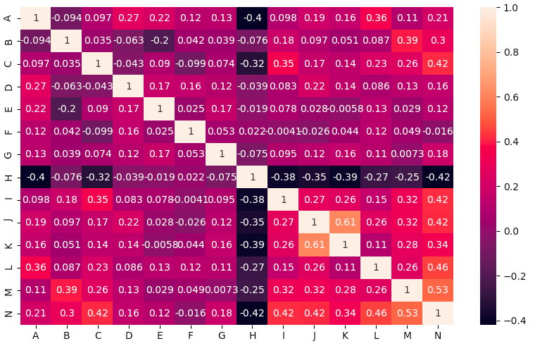
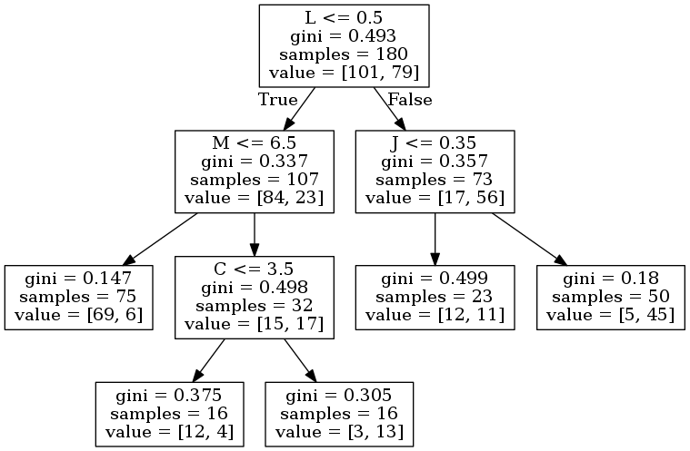

# Examen apprentissage artificiel 
### HUYGHES Antoine
---

### Description:
* Le sujet est disponible [ici](exam.pdf)

### Partie 2:
 * Il y a 270 exemples et 13 caractéristiques différentes 
 * Il y a 150 exemples de la classe 1 et 120 exemples de la classe 2
 * Matrice de corrélation :
 

 ### Partie 3: 
 * On normalise les données grâce à StandardScaler pour avoir la même échelle sur toute les données
 * Base de test : 1/3 
 * Base de train : 2/3
 * Exemple de résultat pour chaque algorithme :
 * MLPClassifier : 
 ```bash
Learning with MLPClassifier :
Train : 0.9111111111111111
Test : 0.8444444444444444
[[38  6]
 [ 8 38]]
 ```
  * KNN :
  * 40 voisins pour éviter le surapprentissage. En moyene, meilleur en test qu'en train
  * Avec 50+ voisins, les résultats étaient à la baisse
  * Avec 30- voisins, les résultats n'étaient pas convaicant 
 ```bash
Learning with KNN :
Train : 0.8611111111111112
Test : 0.8444444444444444
[[47  1]
 [13 29]]
 ```
  * TreeClassifier :
  * max_depth = 4 pour ne pas avoir un arbre qui a surappris, j'ai essayé avec 3 et 5 et il me semble que c'est avec 4 que j'ai de meilleurs résultats
 ```bash
Learning with TreeClassifier :
Train : 0.8722222222222222
Test : 0.8111111111111111
[[47  8]
 [ 9 26]]
 ```
* Exemple d'arbre de décision
 


